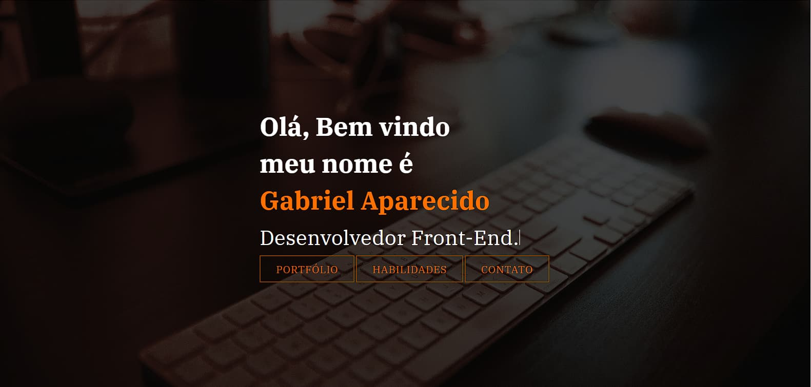

<h1 align="center"> Portfólio </h1>

Projeto realizado durante tech academy, construção de um modelo de portfólio.  
  <a href="gabdev.com.br">Acesse meu Portfolio atual</a>

 
 

  <a href="#-tecnologias">Tecnologias</a>&nbsp;&nbsp;&nbsp;|&nbsp;&nbsp;&nbsp;
  <a href="#-projeto">Projeto</a>&nbsp;&nbsp;&nbsp;|&nbsp;&nbsp;&nbsp;
  <a href="#memo-licença">Licença</a>

  

 

  

## 🚀 Tecnologias

Esse projeto foi desenvolvido com as seguintes tecnologias:

- HTML e CSS
- Git e Github

## 💻 Projeto

Projeto de portfolio totalmente reestilizado para registrar experiências ao longo dos estudos.

- [Acesse a amostra deste projeto](https://gabtech1.github.io/Portfolio/)

## :memo: Licença

Esse projeto está sob a licença MIT.

---

Feito com muita dedicação :wave: